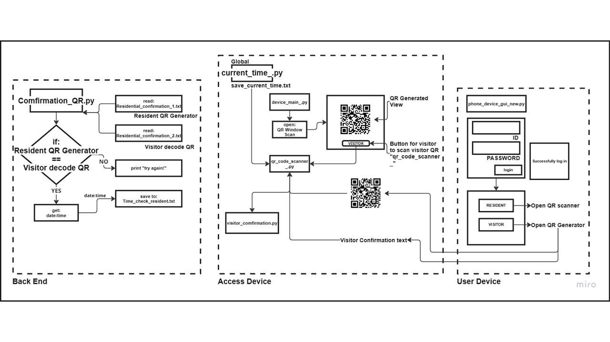

# Resident Access System

This is a **QR Code-based Resident Access System** built using **Python** with **Tkinter** for the GUI and **PIL (Pillow)** for image handling. The system periodically updates a displayed image and allows visitors to trigger a QR code scanning function.

---
## Features
- **Tkinter-based GUI**: Simple user interface with an image panel and a button.
- **QR Code Scanning**: Visitors can press a button to scan a QR code.
- **Automatic Image Refreshing**: The displayed image updates every 5 seconds.
- **Threading for Performance**: Uses a separate thread to handle periodic updates without freezing the GUI.

---
## Installation

### Prerequisites
Ensure you have **Python 3.x** installed on your system.

### Required Libraries
Install the required dependencies using pip:
```sh
    pip install pillow
```

---
## How to Run the Project
1. Clone the repository or download the script.
2. Ensure the image file (`test1.png`) is placed inside the `QR_Access_system/` directory.
3. Run the script:
``` sh
    python device_main.py
```
4. The GUI window will open, displaying the image and a **Visitor** button.
5. Click the **Visitor** button to trigger the QR scan function.
6. The image refreshes every 5 seconds.
7. Scan a QR Code
8. The QR scanner activates using your webcam.
9. When a QR code is detected, the system extracts and saves the QR code data.
10. The visitor confirmation window opens automatically.

11. Exit the Scanner
- `Press 'q' to quit the QR scanner`.

---
## File Structure
QR_Access_System/
│── mdevice_ain.py                 # Runs the GUI application
│── qr_code_scanner.py      # QR code scanning module
│── qr_generator.py         # Generates dynamic QR codes
│── visitor_confirmation.py # Handles visitor confirmation
│── current_time_.py        # Handles time functions
│── QR_Access_system/       # Stores QR images and scanned data
│   ├── test1.png           # Default image displayed in the GUI
│   ├── test*.png           # Dynamically generated QR codes
│   ├── Residential_confirmation_1.txt  # Stores generated QR data
│   ├── Visitor_confirmation_2.txt      # Stores scanned QR data


---
## Code Explanation
- `perpetualTimer`: A custom threading class that periodically executes a function.
- `callback()`: Updates the displayed image every 5 seconds.
- `qr_scan()`: Called when the **Visitor** button is pressed (Imported from `qr_code_scanner_`).
- `root.mainloop()`: Starts the Tkinter event loop.

---
## Possible Enhancements
- Add logging to track visitor access attempts.
- Implement database storage for scanned QR codes.
- Improve UI with additional visitor authentication steps.

---
## How It Works
- main.py initializes the Tkinter GUI and sets a 5-second refresh timer to update the displayed image.
- When the Visitor button is clicked, it calls qr_scan() from qr_code_scanner.py.
- qr_scan() uses OpenCV to capture QR codes from the webcam.
- Once a QR code is detected, its data is saved in QR_Access_system/Visitor_confirmation_2.txt.
- The visitor confirmation is displayed via Tkinter.

---
## Future Enhancements
- Implement a database to store scanned visitor logs.
- Improve UI design with additional styling.
- Enhance security features such as encrypted QR data storage.


